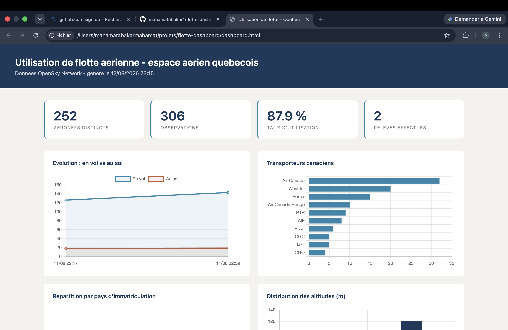

# Tableau de bord d'utilisation de flotte aérienne

Pipeline ETL qui collecte, structure et analyse les données de vol des aéronefs
survolant le Québec, en vue de mesurer le **taux d'utilisation d'une flotte**.

## Problème métier

Dans l'industrie de la location d'aéronefs, un appareil immobilisé au sol ne
génère aucun revenu. Le taux d'utilisation est donc l'indicateur central du
secteur. Ce projet automatise sa mesure à partir de données de vol publiques.

## Architecture

OpenSky Network API (JSON) + Registre Transport Canada (CSV)
  vers Python / pandas (ETL)
  vers SQL Server (schéma en étoile)

## Modèle de données

Schéma en étoile :

| Table | Rôle |
|---|---|
| `dim_aeronef` | Dimension — un enregistrement par appareil (code ICAO24, pays) |
| `fait_observation` | Faits — une observation horodatée par appareil et par passage |

Ce modèle permet d'accumuler l'historique sans dupliquer les référentiels, et
de calculer les taux d'utilisation par période.

## Composants

| Fichier | Rôle |
|---|---|
| `src/auth.py` | Authentification OAuth2 avec renouvellement automatique du jeton |
| `src/extraction.py` | Appel de l'API OpenSky sur une zone géographique, archivage du JSON brut |
| `src/transformation.py` | Conversion en DataFrame, typage, nettoyage, export CSV |
| `src/chargement.py` | Création du schéma et chargement incrémental dans SQL Server |
| `src/icao24_canada.py` | Conversion bidirectionnelle marque d'immatriculation ↔ adresse ICAO24 |
| `src/registre.py` | Intégration du registre Transport Canada et appariement des sources |
| `src/analyse.py` | Requêtes analytiques sur le schéma en étoile |
| `src/dashboard.py` | Génération du tableau de bord HTML |

## Résolution d'identifiants entre sources

Les deux sources décrivent les mêmes aéronefs sans clé commune : OpenSky les
identifie par leur adresse transpondeur ICAO24 (hexadécimale, ex. `c0064c`),
Transport Canada par leur marque d'immatriculation (ex. `C-FCJZ`).

Le bloc canadien d'adresses ICAO24 étant attribué séquentiellement à partir de
`C00001`, la correspondance est calculable. Le module `icao24_canada.py`
implémente cet encodage dans les deux sens, validé sur des paires observées.

**Résultat : 153 appariements sur 160 aéronefs canadiens, soit 96 %.**

La dimension `dim_registre` apporte ainsi le constructeur, le modèle et la
catégorie de chaque appareil observé.

## Technologies

Python 3.13, pandas, requests, SQLAlchemy, pyodbc, SQL Server 2022 (Docker)

## Utilisation

python -m venv venv && source venv/bin/activate
pip install -r requirements.txt
python src/extraction.py && python src/transformation.py && python src/chargement.py

Les identifiants OpenSky sont lus depuis un fichier `.env` non versionné.

## Sources de données

- OpenSky Network — positions ADS-B en temps réel
- Registre des aéronefs civils canadiens (Transport Canada)

## Feuille de route

- [x] Intégration du registre Transport Canada (jointure ICAO24 / immatriculation)
- [x] Requêtes analytiques : taux d'utilisation, temps au sol, routes fréquentes
- [x] Tableau de bord de visualisation
- [ ] Automatisation de la collecte

---

Projet réalisé dans le cadre du programme Spécialiste en développement et
intégration de solutions de données.
